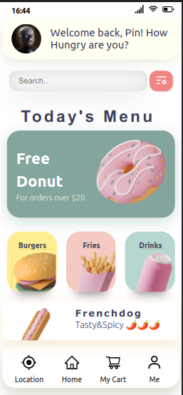
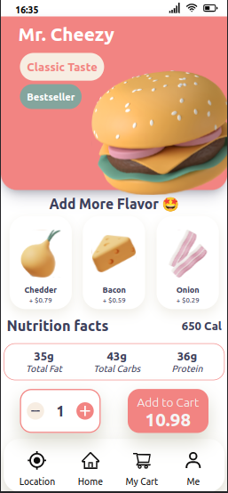
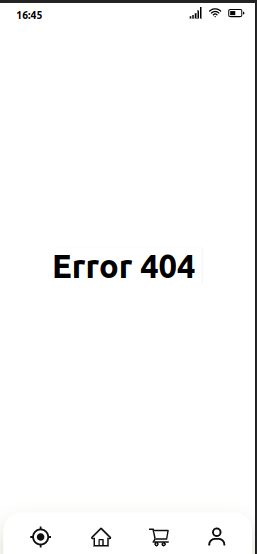
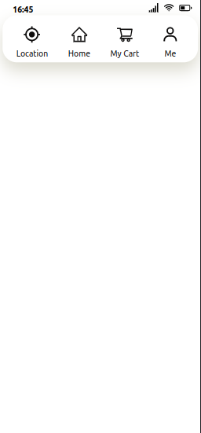

# Web Templates and Projects 

My name is Ruan Lucena Ramos and I have gathered my projects and Web Templates to show you in this repository

The purpose of this repository is to show some projects and templates developed by me as a student of Systems Analysis and Development

Still, these projects and templates were developed using Front End technologies

### **The projects have**:
- Name
- Info
- Development Stack
- How to View
- Image
- Figma Template (if any)
- Link

---

## Landing Page 1

**Food App Mobile**

This template I developed using React Js, the goal was to create a mobile interface for a food app.

I used React Router to create the routes for the other pages in the project, however the "Me" page that will show the settings is not yet complete and is in progress

To visualize this project in the best way : 
Devtools (inspect) > Change Device Toolbar > Iphone XR (75%)

**Development Stack**
- ReactJS with Typescript
- Styled Components
- React Icons
- React Router
- Hover CSS Lib
- Html, CSS
- Figma

**Template Images**

   

### Link to Template :  https://food-moddle-app.surge.sh/

 

---

## Landing Page 2

**Link Shortcut**

This template was developed using ReactJS with Typescript and some React libraries like Lib React-Icons, this project has the objective of being a link shortener, but I didn't direct the links to the correct pages, but I didn't do it 100% , that is, I did not direct the links..

**Template Image**

**Development Stack**
- ReactJS with Typescript
- Html, CSS
- React Icons
- Styled Components
- Hover CSS Lib

### Link to Template :  http://shorlink-rrr.surge.sh/

 

---

## Landing Page 3

**Design driven**

This was my first web landing page developed using ReactJS, it served to further my studies with this library, however I did not manage to finalize it nor to give it functionalities other than its own look

**Template Images**

**Development Stack**
- ReactJS with Typescript
- Html, CSS

### Link to Template :  http://landingpagets.surge.sh/

